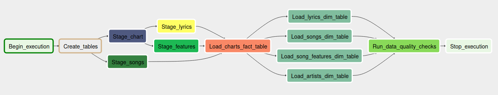

- [Capstone Project - Udacity](#org045122c)
  - [Introduction](#org72437ea)
  - [Tables' organization](#org0c6fe43)
    - [staging\_charts](#org44adb83)
    - [staging\_songs](#orgd6ade63)
    - [staging\_features](#orga8b638d)
    - [staging\_lyrics](#org7125e93)
    - [artists](#org5b0c901)
    - [charts](#orge150a50)
    - [songs](#org898f960)
    - [lyrics](#orgc96a3fd)
    - [song\_features](#org35d062f)
  - [Technologies used](#orgf5b9dce)
    - [AWS](#org89385d3)
    - [Apache Airflow](#orgb593f9b)
    - [APIs](#org2e2d2d3)
    - [Python](#org61708d9)
- [Folder structure](#org5dc2730)
- [Airflow](#orgd169697)
  - [Installation](#org365b376)
  - [Running](#org3fe248b)
  - [DAG](#org6f44c04)
  - [Operators](#org9cecc22)
    - [StageToRedshiftOperator](#org8784025)
    - [LoadBillboardOperator](#orgca813af)
    - [LoadGeniusOperator](#org5ca3f49)
    - [LoadSpotifyOperator](#org12b33ce)
    - [LoadDimensionOperator](#org6d34262)
    - [LoadFactOperator](#org4867c01)
    - [DataQualityOperator](#orgcc41059)
- [Usage](#org4b07cc9)
  - [Future scenarios](#org35a03bf)
    - [The pipeline must be run daily](#orgf2c85a0)
    - [The source data increased 100-fold](#orgdc5d454)
    - [The data must be accessed simultaneously by 100+ users](#org36353b5)
- [Example queries for analysis](#org5e32e52)
  - [Getting all the information](#org33f200a)
  - [Song "complexity" and sentiment](#orgb83f78d)
    - [For a single artist](#orgaf6bdca)
  - [Fade-in and fade-out length](#org98e9372)


<a id="org045122c"></a>

# Capstone Project - Udacity


<a id="org72437ea"></a>

## Introduction

Throughout the years the music landscape has changed from year to year, bringing in new music styles and rhythms. This project aims to organize the information available to better allow an analysis of the evolving trends in music lyrics, rhythm and tempo.

Using the Billboard open API to gather each year's top 100 songs based on sales, radio play, and online streaming, coupled with Genius's API to get each song's lyrics and Spotify's API to get each song's metadata, such as danceability, loudness and tempo, it will be possible to grasp ongoing trends in the music industry. An NLP sentiment analysis is also run on each song's lyrics to further improve the information on each track.


<a id="org0c6fe43"></a>

## Tables' organization

The tables will be organized in a star schema, with:

-   the ranking of songs by Billboard being the facts table;
-   the Million Song Dataset being a dimension table;
-   the Spotify API's result for each song's audio features being another dimension table;
-   and the Genius API's result for each song's lyrics being the last dimension table.

```
      +-----------+                 +----------+
      |           |                 |          |
      |  artists  |                 |  lyrics  |
      |           +-----+    +------+          |
      +-----------+     |    |      +----------+
                     +--+----+--+
                     |          |
                     |  charts  |
                     |          |
                     +--+----+--+
+-----------------+     |    |      +---------+
|                 +-----+    +------+         |
|  song_features  |                 |  songs  |
|                 |                 |         |
+-----------------+                 +---------+
```


<a id="org44adb83"></a>

### staging\_charts

-   chart\_title - title of the chart
-   chart\_name - name of the chart
-   artist\_name - name of the artist
-   song\_name - title of the song
-   chart\_year - year of the chart
-   song\_rank - rank of the song for the given year


<a id="orgd6ade63"></a>

### staging\_songs

-   artist\_id - unique ID for the artist
-   artist\_name - artist's name
-   artist\_latitude - artist's latitude according to Million Song Dataset
-   artist\_longitude - artist's longitude according to Million Song Dataset
-   artist\_location - artist's location according to Million Song Dataset
-   song\_id - unique ID for the song
-   title - song's title
-   duration - song's duration, in seconds
-   year - year the song was published


<a id="orga8b638d"></a>

### staging\_features

-   spotify\_id - Spotify's unique ID for the track
-   artist\_name - artist's name
-   song\_name - song's name
-   duration - duration, in seconds
-   end\_of\_fade\_in - how many seconds before fade in
-   start\_of\_fade\_out - how many seconds before fade out
-   loudness - overall loudness of a track in decibels (dB). Loudness values are averaged across the entire track. Values typical range between -60 and 0 db
-   tempo - overall estimated tempo of a track, in beats per minute (BPM)
-   tempo\_confidence - confidence in the estimated tempo value
-   key - estimated overall key of the track. Integers map to pitches using standard Pitch Class notation . E.g. 0 = C, 1 = C♯/D♭, 2 = D, and so on. If no key was detected, the value is -1
-   key\_confidence - confidence in the estimated key value
-   mode - indicates the modality (major or minor) of a track, the type of scale from which its melodic content is derived. Major is represented by 1 and minor is 0
-   mode\_confidence - confidence in the estimated mode value
-   danceability - describes how suitable a track is for dancing based on a combination of musical elements including tempo, rhythm stability, beat strength, and overall regularity. A value of 0.0 is least danceable and 1.0 is most danceable
-   energy - measure from 0.0 to 1.0 and represents a perceptual measure of intensity and activity. Typically, energetic tracks feel fast, loud, and noisy
-   speechiness - detects the presence of spoken words in a track.
-   acousticness - confidence measure from 0.0 to 1.0 of whether the track is acoustic. 1.0 represents high confidence the track is acoustic
-   instrumentalness - whether a track contains no vocals. The closer the instrumentalness value is to 1.0, the greater likelihood the track contains no vocal content. Values above 0.5 are intended to represent instrumental tracks, but confidence is higher as the value approaches 1.0
-   liveness - presence of an audience in the recording. Higher liveness values represent an increased probability that the track was performed live
-   valence - measure from 0.0 to 1.0 describing the musical positiveness conveyed by a track. Tracks with high valence sound more positive (e.g. happy, cheerful, euphoric), while tracks with low valence sound more negative (e.g. sad, depressed, angry)
-   time\_signature - estimated overall time signature of a track. The time signature (meter) is a notational convention to specify how many beats are in each bar (or measure)


<a id="org7125e93"></a>

### staging\_lyrics

-   artist\_name - artist's name
-   song\_name - song's name
-   lyrics - complete lyrics of the song
-   count\_words - count of the song's words
-   count\_no\_stopwords - count of the song's words after removing stopwords such as \`the\`, \`of\`, \`my\`, &#x2026;
-   count\_distinct\_words - count of the song's distinct words
-   count\_distinct\_no\_stopwords - count of the song's distinct words after removing stopwords
-   count\_distinct\_words\_used\_once - count of song's words that occur only once
-   distinct\_most\_common - comma-separated values of the song's 5 most common words, together with how many times each one occurred
-   count\_most\_common\_usage - sum of the times each of the most common words occurred in the song
-   lyrics\_sentiment - value ranging from -1.0 to 1.0 of the entire lyrics' sentiment analysis, with -1.0 being most extreme negative sentiment, and 1.0 being most extreme positive sentiment
-   common\_words\_sentiment - sentiment analysis of the 5 most common words of the lyrics
-   common\_words\_sentiment\_with\_weights - sentiment analysis of the 5 most common words of lyrics, but weighted by each of those words' occurrence count on the lyrics


<a id="org5b0c901"></a>

### artists

-   artist\_id - unique ID for the artist
-   name - artist's name
-   location - artist's location according to Million Song Dataset
-   latitude - artist's latitude according to Million Song Dataset
-   longitude - artist's longitude according to Million Song Dataset


<a id="orge150a50"></a>

### charts

-   chart\_song\_id - unique ID for the chart entry
-   song\_id - foreign key to the unique ID for the song
-   artist\_id - foreign key to the unique ID for the artist
-   lyrics\_id - foreign key to the unique ID for the lyrics
-   song\_features\_id - foreign key to the unique ID for the song's features
-   rank - rank of the song on the chart for the given year
-   chart\_name - name of the chart
-   year - year of the chart


<a id="org898f960"></a>

### songs

-   song\_id - unique ID for the song
-   title - song's title
-   artist\_id - foreign key to the unique ID for the artist
-   year - year the song was published
-   duration - duration of the song, in seconds


<a id="orgc96a3fd"></a>

### lyrics

-   lyrics\_id - unique ID for the song's lyrics
-   artist\_id - foreign key to the unique ID for the artist
-   song\_id - foreign key to the unique ID for the song
-   count\_words - count of the song's words
-   count\_no\_stopwords - count of the song's words after removing stopwords such as \`the\`, \`of\`, \`my\`, &#x2026;
-   count\_distinct\_words - count of the song's distinct words
-   count\_distinct\_no\_stopwords - count of the song's distinct words after removing stopwords
-   count\_distinct\_words\_used\_once - count of song's words that occur only once
-   distinct\_most\_common - comma-separated values of the song's 5 most common words, together with how many times each one occurred
-   count\_most\_common\_usage - sum of the times each of the most common words occurred in the song
-   lyrics\_sentiment - value ranging from -1.0 to 1.0 of the entire lyrics' sentiment analysis, with -1.0 being most extreme negative sentiment, and 1.0 being most extreme positive sentiment
-   common\_words\_sentiment - sentiment analysis of the 5 most common words of the lyrics
-   common\_words\_sentiment\_with\_weights - sentiment analysis of the 5 most common words of lyrics, but weighted by each of those words' occurrence count on the lyrics


<a id="org35d062f"></a>

### song\_features

-   song\_features\_id - unique ID for the song's features
-   artist\_id - foreign key to the unique ID for the artist
-   song\_id - foreign key to the unique ID for the song
-   fade\_in - how many seconds of fade in at the beginning
-   fade\_out - how many seconds of fade out at the end
-   loudness - overall loudness of a track in decibels (dB). Loudness values are averaged across the entire track. Values typical range between -60 and 0 db
-   tempo - overall estimated tempo of a track, in beats per minute (BPM)
-   tempo\_confidence - confidence in the estimated tempo value
-   key - estimated overall key of the track. Integers map to pitches using standard Pitch Class notation . E.g. 0 = C, 1 = C♯/D♭, 2 = D, and so on. If no key was detected, the value is -1
-   key\_confidence - confidence in the estimated key value
-   mode - indicates the modality (major or minor) of a track, the type of scale from which its melodic content is derived. Major is represented by 1 and minor is 0
-   mode\_confidence - confidence in the estimated mode value
-   danceability - describes how suitable a track is for dancing based on a combination of musical elements including tempo, rhythm stability, beat strength, and overall regularity. A value of 0.0 is least danceable and 1.0 is most danceable
-   energy - measure from 0.0 to 1.0 and represents a perceptual measure of intensity and activity. Typically, energetic tracks feel fast, loud, and noisy
-   speechiness - detects the presence of spoken words in a track.
-   acousticness - confidence measure from 0.0 to 1.0 of whether the track is acoustic. 1.0 represents high confidence the track is acoustic
-   instrumentalness - whether a track contains no vocals. The closer the instrumentalness value is to 1.0, the greater likelihood the track contains no vocal content. Values above 0.5 are intended to represent instrumental tracks, but confidence is higher as the value approaches 1.0
-   liveness - presence of an audience in the recording. Higher liveness values represent an increased probability that the track was performed live
-   valence - measure from 0.0 to 1.0 describing the musical positiveness conveyed by a track. Tracks with high valence sound more positive (e.g. happy, cheerful, euphoric), while tracks with low valence sound more negative (e.g. sad, depressed, angry)
-   time\_signature - estimated overall time signature of a track. The time signature (meter) is a notational convention to specify how many beats are in each bar (or measure)


<a id="orgf5b9dce"></a>

## Technologies used


<a id="org89385d3"></a>

### AWS

1.  Aws.py

    The script \`aws.py\` creates the Redshift cluster following the specifications defined on \`aws.cfg\` in the \`DWH\` configuration, then updates the \`CLUSTER\` configuration with the corresponding cluster endpoint.

2.  S3

    An S3 bucket with the Million Song Dataset is needed for the StageToRedshiftOperator([3.4.1](#org8784025)) to work.

3.  Redshift

    All the tables needed for the ETL pipeline reside on a Redshift instance for later access by the data analysis team. The Redshift cluster must be on the same AWS region as the S3 bucket that contains the Million Song Dataset.


<a id="orgb593f9b"></a>

### Apache Airflow

Airflow is used to execute the DAG defined on [3.3](#org6f44c04) to run the necessary transformations on the data.


<a id="org2e2d2d3"></a>

### APIs

1.  Billboard API

    The Billboard API is used to retrieve each year's top 100 hits, which is then transformed and used as the facts table.
    
    The API is accessed using Billboard.py ([1.3.4.2](#orgb97f54b)) inside LoadBillboardOperator ([3.4.2](#orgca813af)).

2.  Spotify API

    The Spotify API is used to retrieve features and analysis on each track.
    
    The API is accessed using Spotipy ([1.3.4.1](#orgfe67cf9)) inside LoadSpotifyOperator ([3.4.4](#org12b33ce)).
    
    Documentation for the Spotify API can be found on <https://developer.spotify.com/documentation/web-api/reference/>.
    
    In order to access the Spotify API a client ID and SECRET must be obtained on <https://developers.spotify.com/dashboard/login>, and then saved to \`aws.cfg\` in the \`SPOTIFY\` configuration on \`client\_id\` and \`client\_secret\`

3.  Genius API

    The Genius API is used to retrieve the lyrics for each track.
    
    The API is accessed using LyricsGenius ([1.3.4.3](#org80525e6)) inside LoadGeniusOperator ([3.4.3](#org5ca3f49)).
    
    Documentation for the Genius API can be found on <https://docs.genius.com/#/getting-started-h1>.
    
    In order to access the Genius API an access token must be obtained on <https://genius.com/api-clients>, and then saved to \`aws.cfg\` in the \`GENIUS\` configuration on \`client\_token\`.


<a id="org61708d9"></a>

### Python

The following python libs are used in the project:

1.  Spotipy

    Spotipy is used for easier access to Spotify's API ([1.3.3.2](#org5134832)).
    
    Documentation for the lib can be found on <http://spotipy.readthedocs.org/>.
    
    The github of the project is <https://github.com/plamere/spotipy>.
    
    This lib is used on LoadSpotifyOperator ([3.4.4](#org12b33ce)).

2.  Billboard.py

    Billboard.py is used for easier access to Billboard's API ([1.3.3.1](#orgce44dd7)).
    
    The github of the project is <https://github.com/guoguo12/billboard-charts>.
    
    This lib is used on LoadBillboardOperator ([3.4.2](#orgca813af)).

3.  LyricsGenius

    LyricsGenius is used for easier access to Genius' API ([1.3.3.3](#org9f9a9e5)).
    
    Documentation for the lib can be found on <https://lyricsgenius.readthedocs.io/en/master/>.
    
    The github for the project is <https://github.com/johnwmillr/lyricsgenius>.
    
    This lib is used on LoadGeniusOperator ([3.4.3](#org5ca3f49)).

4.  NLTK

    NLTK is used for the extraction of information from each track's lyrics.
    
    This lib is used on LoadGeniusOperator ([3.4.3](#org5ca3f49)).


<a id="org5dc2730"></a>

# Folder structure

```
/
├── data
│   └── song_data - contains a subset of the Million Song Dataaset
│       └── <first letter of song track ID>
│           └── <second letter of song track ID>
│               └── <third letter of song track ID>
│                   ├── (...)
│                   └── TR<track ID>.json
├── airflow
│   ├── create_tables.sql - SQL queries to create the necessary tables on Redshift
│   ├── dags - Airflow DAGs for the project
│   │   └── udac_music_trend_analysis.py - project DAGs configurations
│   └── plugins - custom Airflow plugins for the project
│       ├── helpers
│       │   └── sql_queries.py - SQL queries needed for the project
│       └── operators
│           ├── data_quality.py - DataQualityOperator
│           ├── load_dimension.py - LoadDimensionOperator
│           ├── load_fact.py - LoadFactOperator
│           ├── stage_redshift.py - StageToRedshiftOperator
│           ├── load_genius.py - LoadGeniusOperator
│           ├── load_billboard.py - LoadBillboardOperator
│           └── load_spotify.py - LoadSpotifyOperator
├── jsonpath - folder containing the jsonpath for copying data from S3 to Redshift
│   └── staging_song_data.jsonpath
├── README.md - this file in markdown
├── README.org - this file in orgmode
├── aws.py - code to parse the aws.cfg file and create the necessary AWS resources
└── aws.cfg - config file with the requirements for the AWS resources to be used and for the DAG to run
```


<a id="orgd169697"></a>

# Airflow


<a id="org365b376"></a>

## Installation

In order to install Airflow locally, the following command must be run:

```bash
$ pip install apache-airflow==1.10.12 \
      --constraint "https://raw.githubusercontent.com/apache/airflow/constraints-1.10.12/constraints-3.8.txt"
```

Then update the file \`~/airflow/airflow.cfg\` and set \`dags\_folder\` to the dags folder of the project, and set \`plugins\_folder\` to the plugins folder of the project. And run:

```bash
$ airflow initdb
```

Optionally you can set \`load\_examples\` to False before running \`airflow initdb\`, to show only the DAGs related to the project.


<a id="org3fe248b"></a>

## Running

After installing Airflow, run the following command:

```bash
$ airflow scheduler
```

And in another terminal:

```bash
$ airflow webserver
```

These will start the Airflow scheduler and webserver, respectively. The Airflow webserver will be available on <http://localhost:8080/>


<a id="org6f44c04"></a>

## DAG

The DAG for the project runs as follows:



1.  \`Begin\_execution\` marks the beginning of the DAG, it does nothing
    -   the DummyOperator is used
2.  \`Create\_tables\` creates the necessary tables, but only if they don't yet exist
    -   the PostgresOperator is used
    -   the SQL query run to create the tables is stored in <./airflow/plugins/helpers/sql_queries.py> in \`SqlQueries.create\_tables\`
3.  \`Stage\_songs\` loads the Million Song Dataset from an S3 bucket into the table \`staging\_songs\`
    -   the StageToRedshiftOperator is used ([3.4.1](#org8784025))
    -   the S3 bucket configurations is located on \`aws.cfg\` in the \`S3\` configuration on \`bucket\` and \`song\_folder\`
    -   the jsonpath needed to copy the data is located on \`aws.cfg\` in the \`S3\` configuration on \`song\_jsonpath\`
4.  \`Stage\_chart\` loads a Billboard chart into the table \`staging\_charts\`
    -   the LoadBillboardOperator is used ([3.4.2](#orgca813af))
    -   the chart to be loaded is defined on \`aws.cfg\` in the \`BILLBOARD\` configuration on \`chart\_name\`
    -   the year to be loaded is taken from the \`execution\_date\` of the DAG context, this allows backfilling
5.  \`Stage\_lyrics\` gets the songs loaded by \`Stage\_chart\` and extracts information from their lyrics, then inserts them into \`staging\_lyrics\`
    -   the LoadGeniusOperator is used ([3.4.3](#org5ca3f49))
    -   the client access token is stored on \`aws.cfg\` in the \`GENIUS\` configuration on \`client\_token\`
6.  \`Stage\_features\` gets the songs loaded by \`Stage\_chart\` and gets the tracks' features, then inserts them into \`staging\_song\_features\`
    -   the LoadSpotifyOperator is used ([3.4.4](#org12b33ce))
    -   the client id and secret are stored on \`aws.cfg\` in the \`SPOTIFY\` configuration on \`client\_id\` and \`client\_secret\`
7.  \`Load\_charts\_fact\_table\` queries the \`staging\_charts\` table and inserts the data into \`charts\`
    -   the LoadFactOperator is used ([3.4.6](#org4867c01))
    -   the SQL query run to query and insert the data is stored in <./airflow/plugins/helpers/sql_queries.py> in \`SqlQueries.chart\_table\_insert\`
8.  \`Load\_lyrics\_dim\_table\` queries the \`staging\_lyrics\` table and inserts the data into \`lyrics\`
    -   the LoadDimensionOperator is used ([3.4.5](#org6d34262))
    -   the SQL query run to query and insert the data is stored in <./airflow/plugins/helpers/sql_queries.py> in \`SqlQueries.lyrics\_table\_insert\`
9.  \`Load\_songs\_dim\_table\` queries the \`staging\_charts\` and \`staging\_songs\` tables and inserts the data into \`songs\`
    -   the LoadDimensionOperator is used ([3.4.5](#org6d34262))
    -   the SQL query run to query and insert the data is stored in <./airflow/plugins/helpers/sql_queries.py> in \`SqlQueries.song\_table\_insert\`
10. \`Load\_song\_features\_dim\_table\` queries the \`staging\_features\` table and inserts the data into \`song\_features\`
    -   the LoadDimensionOperator is used ([3.4.5](#org6d34262))
    -   the SQL query run to query and insert the data is stored in <./airflow/plugins/helpers/sql_queries.py> in \`SqlQueries.song\_feature\_table\_insert\`
11. \`Load\_artists\_dim\_table\` queries the \`staging\_charts\` and \`staging\_songs\` tables and inserts the data into \`artists\`
    -   the LoadDimensionOperator is used ([3.4.5](#org6d34262))
    -   the SQL query run to query and insert the data is stored in <./airflow/plugins/helpers/sql_queries.py> in \`SqlQueries.artist\_table\_insert\`
12. \`Run\_data\_quality\_checks\` runs a series of SQL queries that are expected to return 0 as a result, if the data was properly loaded by the other operators
    -   the DataQualityOperator is used ([3.4.7](#orgcc41059))
    -   the SQL queries run to assert the data quality are stored in <./airflow/plugins/helpers/sql_queries.py> in \`SqlQueries.select\_nulls\_count\`
13. \`Stop\_execution\` marks the end of the DAG, it does nothing
    -   the DummyOperator is used


<a id="org9cecc22"></a>

## Operators


<a id="org8784025"></a>

### StageToRedshiftOperator

The StageToRedshiftOperator copies data from an S3 bucket on AWS to a Redshift table.


<a id="orgca813af"></a>

### LoadBillboardOperator

The LoadBillboardOperator gets the \`execution\_year\` from the context, and a Billboard chart name from the parameters.

The operator then uses the \`billboard\` python lib to get the rankings for the given year and chart.

The rankings are inserted into a table whose name is received as a parameter.


<a id="org5ca3f49"></a>

### LoadGeniusOperator

The LoadGeniusOperator gets the \`execution\_year\` from the context, and a Billboard chart name from the parameters; these are used to query the \`staging\_charts\` table to get the songs that were inserted and whose track features should be queried.

The operator then uses the \`lyricsgenius\` python lib to get the lyrics of the track.

Then the \`nltk\` python lib is used to derive more information from the lyrics of the track, such as overall sentiment, word count, unique word count, and most used words.

Afterwards the information is inserted into the table whose name was received in the parameters.


<a id="org12b33ce"></a>

### LoadSpotifyOperator

The LoadSpotifyOperator gets the \`execution\_year\` from the context, and a Billboard chart name from the parameters; these are used to query the \`staging\_charts\` table to get the songs that were inserted and whose track features should be queried.

The operator then uses the \`spotipy\` python lib to search for the songs and get their ID on Spotify, which is subsequently used to get the tracks' features and analysis.

The values are then inserted into the table whose name was received in the parameters.


<a id="org6d34262"></a>

### LoadDimensionOperator

The LoadDimensionOperator runs received SQL queries to insert data into the dimension tables.


<a id="org4867c01"></a>

### LoadFactOperator

The LoadFactOperator runs a received SQL query to insert data into the facts table.


<a id="orgcc41059"></a>

### DataQualityOperator

The DataQualityOperator runs queries received in its parameters and compares them to the expected values also received in the parameters.

An optional parameter \`continue\_after\_fail\` allows running all checks, even if a previous check has failed.


<a id="org4b07cc9"></a>

# Usage

In order to run this project, the following steps must be taken:

1.  Install and run Airflow
    -   the steps are described on [3](#orgd169697)
2.  Create the Redshift cluster
    -   the \`aws.py\` script creates the cluster ([1.3.1.1](#org9b36002))
3.  Turn on the DAG
    -   this will start backfilling with data from 2006 (which is the first year the \`Hot 100 Songs - Year End\` was created on Billboard)

After this, the progress of the ETL pipeline can be followed on Airflow's webserver, and the data can be queried on the Redshift cluster.


<a id="org35a03bf"></a>

## Future scenarios


<a id="orgf2c85a0"></a>

### The pipeline must be run daily

This pipeline is supposed to be run yearly, since that's the frequency with which Billboard releases another chart. However, if another source were to be chosen as the origin of the \`charts\` facts table, the ETL pipeline could be made to run daily simply changing the \`schedule\_interval\` on \`udac\_music\_trend\_analysis.py\` to \`@daily\`.

Since the entire pipeline takes some time to run (mainly due to the bottleneck on \`Stage\_lyrics\`) this could cause some delay for the data to be available for querying. In the case where this bottleneck becames too much, the LoadGeniusOperator could be modified to use multiple threads to query the Genius API and improve the overall performance of the project.


<a id="orgdc5d454"></a>

### The source data increased 100-fold

If the source data were to increase 100-fold, a redesign on LoadGeniusOperator and LoadSpotifyOperator would be imperative.

The redesign could consist of refactoring them to have subDAGs, where each subDAG will take a partition of the data to be accessed, and process them independently from each other. This will allow a better throughput of the greatest bottlenecks of the project (namely the external API accesses).

However extra care must be taken in order to not overuse the APIs. If too many 429 responses are being received, it might be the time to contact Genius and Spotify to get a direct access to the data or otherwise factor in the rate limit of the APIs being accessed.


<a id="org36353b5"></a>

### The data must be accessed simultaneously by 100+ users

Since the data is stored on a Redshift cluster, how many users can try to access it simultaneously is only limited by AWS.


<a id="org5e32e52"></a>

# Example queries for analysis


<a id="org33f200a"></a>

## Getting all the information

To get all the information for an OLAP cube, the following query can be run, and from there it is possible to slice and dice the data accordingly to what information is needed.

```sql
SELECT *
FROM charts
JOIN songs
    ON songs.song_id = charts.song_id
JOIN song_features
    ON song_features.song_id = charts.song_id
   AND song_features.artist_id = charts.artist_id
JOIN artists
    ON artists.artist_id = charts.artist_id
JOIN lyrics
    ON lyrics.artist_id = charts.artist_id
   AND lyrics.song_id = charts.song_id;
```

or the following query to get only the information, without the ids:

```sql
SELECT 
       charts.chart_name, charts.rank, charts.year,
       songs.title,
       artists.name,
       song_features.fade_in, song_features.fade_out, 
       song_features.loudness, song_features.danceability, song_features.energy, 
       song_features.speechiness, song_features.acousticness, song_features.instrumentalness,
       song_features.liveness, song_features.valence, song_features.time_signature,
       song_features.tempo, song_features.tempo_confidence, 
       song_features.key, song_features.key_confidence, 
       song_features.mode, song_features.mode_confidence, 
       lyrics.count_words, lyrics.count_no_stopwords, 
       lyrics.count_distinct_words, lyrics.count_distinct_no_stopwords, lyrics.count_distinct_words_used_once, 
       lyrics.distinct_most_common, lyrics.count_most_common_usage, 
       lyrics.lyrics_sentiment, lyrics.common_words_sentiment, lyrics.common_words_sentiment_with_weights
FROM charts
JOIN songs
    ON songs.song_id = charts.song_id
JOIN song_features
    ON song_features.song_id = charts.song_id
   AND song_features.artist_id = charts.artist_id
JOIN artists
    ON artists.artist_id = charts.artist_id
JOIN lyrics
    ON lyrics.artist_id = charts.artist_id
   AND lyrics.song_id = charts.song_id
ORDER BY year DESC, rank ASC;
```


<a id="orgb83f78d"></a>

## Song "complexity" and sentiment

In order to analyse a trend in overall track sentiment and (an oversimplification of its) complexity, it is possible to get the tracks' ranking in each year accompanied by each track's overall sentiment and word count.

```sql
SELECT
       charts.year,
       CAST( AVG(lyrics.count_words) AS DECIMAL(6,2) ) AS avg_count_words,
       CAST( AVG(lyrics.count_no_stopwords) AS DECIMAL(6,2) ) AS avg_count_no_stopwords,
       CAST( AVG(lyrics.lyrics_sentiment) AS DECIMAL(6,2) ) AS avg_lyrics_sentiment
FROM charts
JOIN lyrics
    ON lyrics.artist_id = charts.artist_id
   AND lyrics.song_id = charts.song_id
WHERE charts.rank >= 5
GROUP BY charts.year
ORDER BY year DESC;   
```

By altering the WHERE clause it is possible to change how many of the top tracks of each year are to be considered.

Looking at the data between 2006 and 2012 we obtain the following results:

| year | avg\_count\_words | avg\_count\_no\_stopwords | avg\_lyrics\_sentiment |
|---- |----------------- |------------------------- |---------------------- |
| 2012 | 335.00            | 159.00                    | 0.93                   |
| 2011 | 414.57            | 203.97                    | 0.63                   |
| 2010 | 383.24            | 185.47                    | 0.65                   |
| 2009 | 401.22            | 198.60                    | 0.41                   |
| 2008 | 407.07            | 195.12                    | 0.47                   |
| 2007 | 391.00            | 186.82                    | 0.40                   |
| 2006 | 417.41            | 203.93                    | 0.27                   |

which indicates a trend in happier sentiment in each track's lyrics, and a slight downward trend in word count.


<a id="orgaf6bdca"></a>

### For a single artist

The previous query can be run slicing the artist's dimension to get the information on a single artist, instead of over the complete data:

```sql
SELECT
       charts.year,
       CAST( AVG(lyrics.count_words) AS DECIMAL(6,2) ) AS avg_count_words,
       CAST( AVG(lyrics.count_no_stopwords) AS DECIMAL(6,2) ) AS avg_count_no_stopwords,
       CAST( AVG(lyrics.lyrics_sentiment) AS DECIMAL(6,2) ) AS avg_lyrics_sentiment
FROM charts
JOIN lyrics
    ON lyrics.artist_id = charts.artist_id
   AND lyrics.song_id = charts.song_id
JOIN artists
    ON artists.artist_id = charts.artist_id
WHERE artists.name LIKE '%Kanye West%'
GROUP BY charts.year
ORDER BY year DESC;    
```

The \`LIKE\` operator must be used to account for songs made by the artist in conjunction with other artists, but a simple \`=\` operator could be used if only the tracks made by the artist alone were to be considered.


<a id="org98e9372"></a>

## Fade-in and fade-out length

The following query can be used to query the average of each year's top 5 songs' average fade-in and fade-out length.

```sql
SELECT
       charts.year,
       CAST( AVG( song_features.fade_in ) AS DECIMAL(6,2) ) AS avg_fade_in,
       CAST( AVG( song_features.fade_out ) AS DECIMAL(6,2) ) AS avg_fade_out,
       CAST( AVG( songs.duration ) AS DECIMAL(6,2) ) AS avg_duration
FROM charts
JOIN song_features
    ON song_features.artist_id = charts.artist_id
   AND song_features.song_id = charts.song_id
JOIN songs
    ON songs.song_id = charts.song_id
WHERE charts.rank >= 5
GROUP BY charts.year
ORDER BY year DESC;   
```

The same query can be run to analyse other song features, such as danceability, tempo, key and beats per minute, depending on what is intended to be extracted.